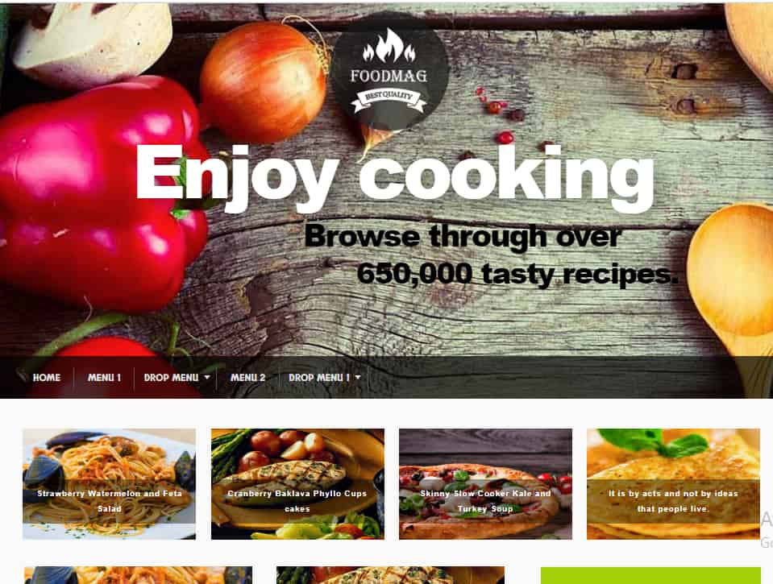

# 🍴 WordPress Food Blog Project

## 🚀 Live Preview
[Coming Soon]

## 📌 Description
A beautifully designed and responsive **WordPress Food Blog** developed using a free theme and essential plugins. The website is ideal for food bloggers to showcase their recipes, cooking tips, and lifestyle content.

This project demonstrates my ability to work with WordPress themes, customize layout using Elementor, and integrate plugins like WPForms for contact functionality.
---

## 🛠️ Tech Stack

- **WordPress**
- **PHP**
- **HTML / CSS**
- **Elementor (Free Page Builder)**
- **WPForms (Contact Form Plugin)**
- **Theme:** [Any Free Theme Used – Mention It Here]
- **Plugins:** Elementor, WPForms, Contact Widgets, etc.

---

## 📸 Screenshots

> 📷 Add screenshots after deploying  
> Example:
- 
- 
- 

---

## 💡 Key Features

- 📝 Custom homepage layout with featured recipes
- 📚 Blog archive with category-based filtering
- 📧 Contact form using WPForms
- 📱 Fully responsive on all devices
- 🌙 Clean and minimalist design suitable for food content

---

## 📁 Installation Instructions

1. Download the ZIP or clone the repo:
   ```bash
   git clone https://github.com/yourusername/wordpress-food-blog.git
2.Upload the files to your local WordPress installation:

Use tools like XAMPP / MAMP for localhost

Place theme files in /wp-content/themes/

Activate theme from WordPress admin panel

3.Install required plugins:

Elementor

WPForms

Any others you used

🙋‍♀️ Author
Prithi Babu
🌐 GitHub
📫 LinkedIn

⭐ Acknowledgements
Thanks to the open-source community and free plugin developers.

Built as part of my preparation for the rtCamp Associate Software Engineer role.


Would you like a **matching README for the restaurant website** project next?  
I can also create screenshot placeholders or folder structure if needed.


